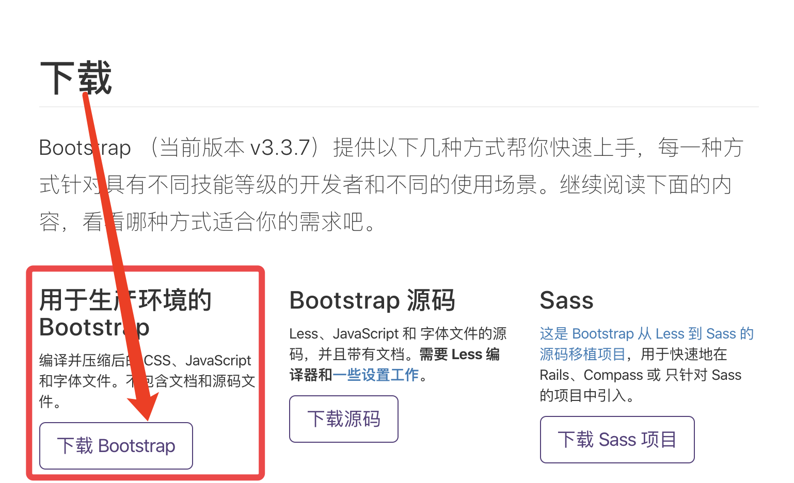
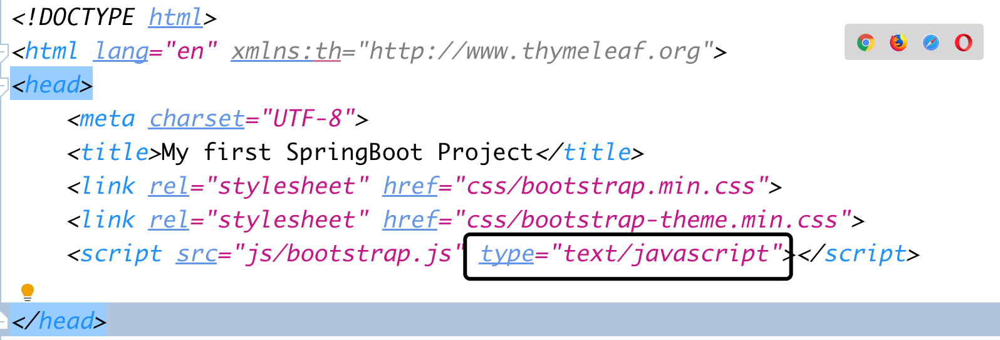
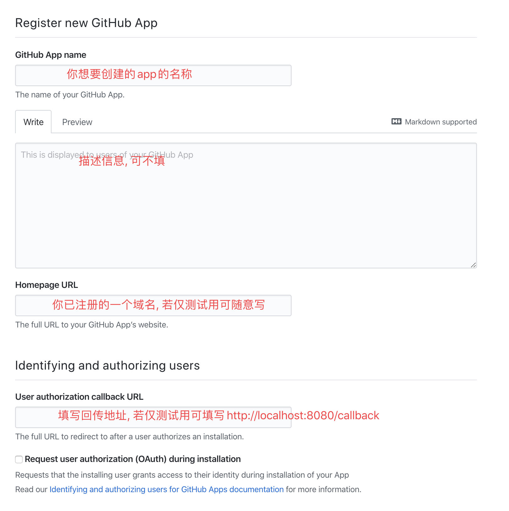
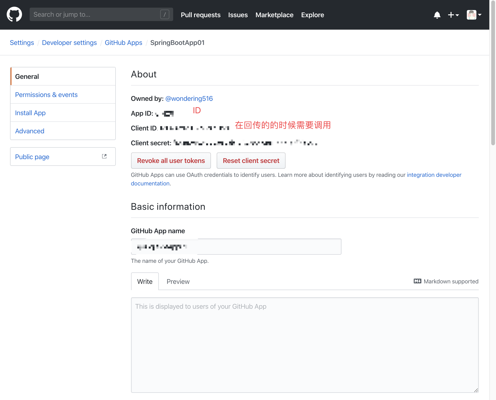

# 初学SpringBoot

## 师从小匠
https://www.bilibili.com/video/av62800055

## 附带复习Git语法

* `git init` 初始化仓库
* `git remote add origin [url]` 添加你远程仓库的地址
* `git status` 查看当前仓库状态
* `git add .` 注意`.`不能丢, 将所有文件添加到缓存区
* `git commit -m"[description]"` 提交, 并添加描述
* `git push origin` 默认将缓存区的文件提交到远程仓库的master文件下

## 1. 使用`BootStrap`简化学习流程

### 1.1 下载`BootStrap`
**下载地址**
* https://v3.bootcss.com/getting-started/#download



### 1.2 使用`BootStrap`导航条
**导航条地址**
* https://v3.bootcss.com/components/#navbar
**复制导航条代码**
```html
<nav class="navbar navbar-default">
  <div class="container-fluid">
    <!-- Brand and toggle get grouped for better mobile display -->
    <div class="navbar-header">
      <button type="button" class="navbar-toggle collapsed" data-toggle="collapse" data-target="#bs-example-navbar-collapse-1" aria-expanded="false">
        <span class="sr-only">Toggle navigation</span>
        <span class="icon-bar"></span>
        <span class="icon-bar"></span>
        <span class="icon-bar"></span>
      </button>
      <a class="navbar-brand" href="#">Brand</a>
    </div>

    <!-- Collect the nav links, forms, and other content for toggling -->
    <div class="collapse navbar-collapse" id="bs-example-navbar-collapse-1">
      <ul class="nav navbar-nav">
        <li class="active"><a href="#">Link <span class="sr-only">(current)</span></a></li>
        <li><a href="#">Link</a></li>
        <li class="dropdown">
          <a href="#" class="dropdown-toggle" data-toggle="dropdown" role="button" aria-haspopup="true" aria-expanded="false">Dropdown <span class="caret"></span></a>
          <ul class="dropdown-menu">
            <li><a href="#">Action</a></li>
            <li><a href="#">Another action</a></li>
            <li><a href="#">Something else here</a></li>
            <li role="separator" class="divider"></li>
            <li><a href="#">Separated link</a></li>
            <li role="separator" class="divider"></li>
            <li><a href="#">One more separated link</a></li>
          </ul>
        </li>
      </ul>
      <form class="navbar-form navbar-left">
        <div class="form-group">
          <input type="text" class="form-control" placeholder="Search">
        </div>
        <button type="submit" class="btn btn-default">Submit</button>
      </form>
      <ul class="nav navbar-nav navbar-right">
        <li><a href="#">Link</a></li>
        <li class="dropdown">
          <a href="#" class="dropdown-toggle" data-toggle="dropdown" role="button" aria-haspopup="true" aria-expanded="false">Dropdown <span class="caret"></span></a>
          <ul class="dropdown-menu">
            <li><a href="#">Action</a></li>
            <li><a href="#">Another action</a></li>
            <li><a href="#">Something else here</a></li>
            <li role="separator" class="divider"></li>
            <li><a href="#">Separated link</a></li>
          </ul>
        </li>
      </ul>
    </div><!-- /.navbar-collapse -->
  </div><!-- /.container-fluid -->
</nav>
```


### 1.3 加载`Bootstrap`后无法显示样式
**原因**

* 未添加`type="text/javascript"`

## 2. 注册`github`app
### 2.1 注册地址
* https://github.com/settings/apps/new

### 2.2 填写相关信息


### 2.3 查看已注册的app的信息
